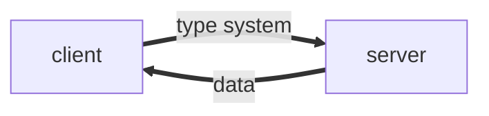

---
# try also 'default' to start simple
theme: seriph
# random image from a curated Unsplash collection by Anthony
# like them? see https://unsplash.com/collections/94734566/slidev
# background: https://source.unsplash.com/collection/94734566/1920x1080
# apply any windi css classes to the current slide
class: 'text-center'
# https://sli.dev/custom/highlighters.html
highlighter: shiki
# show line numbers in code blocks
lineNumbers: false
# some information about the slides, markdown enabled
info: |
  ## Slidev Starter Template
  Presentation slides for developers.

  Learn more at [Sli.dev](https://sli.dev)
# persist drawings in exports and build
drawings:
  persist: false

monaco: true
---

<div class="text-base-3xl inline-flex justify-center items-center">
  <logos-graphql class="text-8xl" /> GraphQl
</div>

---

###  New API style

2012年，<logos-facebook></logos-facebook> **Facebook** 在他们的原生移动应用中使用了 GraphQl , 在此之前，通用的 API 风格是 RESTful,而 GraphQL 是一个新的API标准, 它更加高效，更加强大的和更加灵活

---

### 起源

GraphQL 的出现源于移动端对高效加载数据的需求，这种情况下使用传统的 RESTful API 很难满足持续部署和快速迭代的需求.
这样的想法并非只有 Facebook 独有，Netflix 开源过类似的方案 [falcor](https://github.com/Netflix/falcor)


<div class="border-t-2 mt-4 mb-4"></div>

* [reference](https://www.howtographql.com/basics/0-introduction/)

---

### 优势

在此之前,REST 的概念是由*Roy Fielding*在 [Representational State Transfer (REST)](https://www.ics.uci.edu/~fielding/pubs/dissertation/rest_arch_style.htm) 中提出,

但是 RESTful 风格的 API 设计存在如下问题

* 后端返回的数据存在冗余,过度数据传输
* API数量很多
* 后端和前端需要反复确认数据结构

---

GraphQL 是一个用于 API 的查询语言，是一个使用基于类型系统来执行查询的服务端运行时（类型系统由你的数据定义）


---




而这些所有的查询都是基于同一个api进行

<div v-click>


一个典型的 GraphQl 查询语句如下

```graphql
person{
  name
}
```
</div>

[playground](https://countries.trevorblades.com/)

---


---

### 推进 GraphQl 的使用

1. 在推出 GraphQl 之时，只应用在 react的应用中

<div class="color-cyan">
  其他语言的`GraphQl`实现 [Language Implementations](https://graphql.org/code/)
</div>

2. GraphQL 的 field resolve 如果按照 naive 的方式来写，每一个 field 都对数据库直接跑一个 query，会产生大量冗余 query，虽然网络层面的请求数被优化了，但数据库查询可能会成为性能瓶颈，这里面有很大的优化空间，但并不是那么容易做。FB 本身没有这个问题，因为他们内部数据库这一层也是抽象掉的，写 GraphQL 接口的人不需要顾虑 query 优化的问题。

3. 这个事情到底由谁来做？GraphQL 的利好主要是在于前端的开发效率，但落地却需要服务端的全力配合。如果是小公司或者整个公司都是全栈，那可能可以做，但在很多前后端分工比较明确的团队里，要推动 GraphQL 还是会遇到各种协作上的阻力。这可能是没火起来的根本原因。

ref: https://www.zhihu.com/question/38596306/answer/79714979

---

