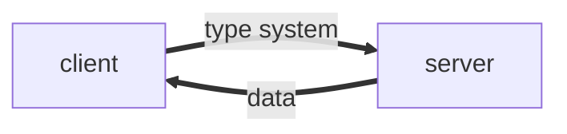

---
# try also 'default' to start simple
theme: seriph
# random image from a curated Unsplash collection by Anthony
# like them? see https://unsplash.com/collections/94734566/slidev
# background: https://source.unsplash.com/collection/94734566/1920x1080
# apply any windi css classes to the current slide
class: 'text-center'
# https://sli.dev/custom/highlighters.html
highlighter: shiki
# show line numbers in code blocks
lineNumbers: false
# some information about the slides, markdown enabled
info: |
  ## Slidev Starter Template
  Presentation slides for developers.

  Learn more at [Sli.dev](https://sli.dev)
# persist drawings in exports and build
drawings:
  persist: false

monaco: true
---

<div class="text-base-3xl inline-flex justify-center items-center">
  <logos-graphql class="text-8xl" /> GraphQl
</div>

---

###  New API style

2012年，<logos-facebook></logos-facebook> **Facebook** 在他们的原生移动应用中使用了 GraphQl , 在此之前，通用的 API 风格是 RESTful,而 GraphQL 是一个新的API标准, 它更加高效，更加强大的和更加灵活

---

### 解决了什么问题?

设想这样一个场景，当前页面需要新增卡片组件，显示员工的人名和职位，此时既有的接口包含了“所有的员工信息”
* 使用旧的的接口，存在数据传输冗余
* 设计新的接口， 需要和后端反复沟通，且维护的api数量越来越多

```json
{
  "employee": [
    {
      "id": "1",
      "firstName": "Tom",
      "lastName": "Cruise",
      "nation": "USA",
      "Language": "English",
      "job": "Director"
      ...
    },
    ...
  ]
}

```

---

### 优势

在此之前,我们使用的API风格被称为 RESTful , 是由*Roy Fielding*在 [Representational State Transfer (REST)](https://www.ics.uci.edu/~fielding/pubs/dissertation/rest_arch_style.htm) 中提出,

但是 RESTful 风格的 API 设计存在如下问题

* 后端返回的数据存在冗余,过度数据传输
* API数量很多
* 后端和前端需要反复确认数据结构

<div class="text-blue-500">

  而使用 GraphQl 的 API 设计，我们只需要通过一个接口就能精准获取所需的信息

</div>

---

### 起源

最开始使用 REST 的方式开发，是因为当时的客户端程序相对简单,而现在不同平台，不同框架的出现,构造的客户端程序页越来越复杂
也需要一种高效快速的数据加载和程序开发的方式

GraphQL 的出现源于移动端对高效加载数据的需求，

1. 使用 REST 往往需要去修改服务器暴露给客户端的数据，这阻碍了快速开发产品
这样的想法并非只有 Facebook 独有，Netflix 开源过类似的方案 [falcor](https://github.com/Netflix/falcor)


* [reference](https://www.howtographql.com/basics/0-introduction/)

---
layout: two-cols
---

GraphQL 是一个用于 API 的查询语言，是一个使用基于类型系统来执行查询的服务端运行时（类型系统由你的数据定义）

<!--  -->



::right::


<div class="ml-10">

  而这些所有的查询都是基于同一个api进行, 一个典型的 GraphQl 查询语句如下

```graphql
query {
  country(code: "CN") {
    name
  }
}

```

[playground](https://countries.trevorblades.com/)

</div>


---


三种查询操作

1. query - 只读查询操作
2. mutation - 修改操作
3. subscription - 订阅一个事件，长期接受响应,其结果随着时间改变而改变

---

带参数查询

```graphql
{
  user(id: 4) {
    name
  }
}
```

::right::

<div class="ml-2">

结果

```json
{
  "user": {
    "name": "Mark Zuckerberg"
  }
}
```

</div>

---

当存在多个相同的查询参数时或者想要动态的查询，可以使用 graphql 提供的变量,从而避免在客户端生成字符串

```graphql
query getContinent($code: String = "EU") {
  continents(code: $code) {
    code
    name
  }
}
```


在提交查询的时候可以把变量的定义带上，也可以提供一个默认值
```json
{
  query: ...,
  variables: {
    "code": "AS"
  }
}
```

---

使用 GraphQl 修改数据

```graphql
mutation {
  likeStory(storyID: 12345) {
    story {
      likeCount
    }
  }
}
```

---

除了最常见的查询，如果想要进一步的性能提升,使用 graphql 还需要对缓存、权限管理等做进一步考虑和设置

---

### 推进 GraphQl 的使用

1. 在推出 GraphQl 之时，只在 react 中使用,社区其他语言和框架对 GraphQl 缺乏支持


<span class="text-blue-500">

 现在主流语言基本上都有对应的社区框架使用 其他语言的`GraphQl`实现 [Language Implementations](https://graphql.org/code/)

</span>


2. GraphQl 每一个字段对应一个 resolver， 每个 resolver 每一次查询都要去跑一次数据库,怎么优化？
```js
  person: ({id}) => database.getPerson(id)
```


3. 这个事情到底由谁来做？GraphQL 的利好主要是在于前端的开发效率，但落地却需要服务端的全力配合。如果是小公司或者整个公司都是全栈，那可能可以做，但在很多前后端分工比较明确的团队里，要推动 GraphQL 还是会遇到各种协作上的阻力。这可能是没火起来的根本原因


ref: https://www.zhihu.com/question/38596306/answer/79714979
