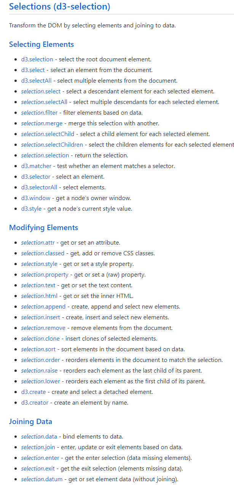
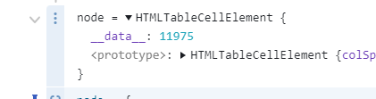

# JavaScript 可视化库D3介绍

## 渲染器的选择
在
- SVG
- Canvas
- HTML element
> 一般来说，Canvas 更适合绘制图形元素数量较多（这一般是由数据量大导致）的图表（如热力图、地理坐标系或平行坐标系上的大规模线图或散点图等），也利于实现某些视觉 特效。但是，在不少场景中，SVG 具有重要的优势：它的内存占用更低（这对移动端尤其重要）、并且用户使用浏览器内置的缩放功能时不会模糊。
> 选择哪种渲染器，我们可以根据软硬件环境、数据量、功能需求综合考虑。
>  在软硬件环境较好，数据量不大的场景下，两种渲染器都可以适用，并不需要太多纠结。
> 在环境较差，出现性能问题需要优化的场景下，可以通过试验来确定使用哪种渲染器。比如有这些经验：
> 在须要创建很多 ECharts 实例且浏览器易崩溃的情况下（可能是因为 Canvas 数量多导致内存占用超出手机承受能力），可以使用 SVG 渲染器来进行改善。大略得说，如果图表运行在低端安卓机，或者我们在使用一些特定图表如 水球图 等，SVG 渲染器可能效果更好。
> 数据量较大（经验判断 > 1k）、较多交互时，建议选择 Canvas 渲染器。
> 我们强烈欢迎开发者们反馈给我们使用的体验和场景，帮助我们更好的做优化。

d3.js当中主要使用SVG, 进行开发，相比直接操作恶心的HTML DOM,D3提供的一套声明式语法更加舒服。


```js
var paragraphs = document.getElementsByTagName("p");
for (var i = 0; i < paragraphs.length; i++) {
  var paragraph = paragraphs.item(i);
  paragraph.style.setProperty("color", "blue", null);
}
```

## d3当中的核心概念

### selection
#### 概念

d3当中大部分的东西都是针对[selection](https://observablehq.com/@d3/d3-selection-2-0)进行的，包括事件侦听、style属性设置、数据绑定等等

通过以下函数可以生成`selection`
```js
d3.create() //创造一个元素
d3.select() //选择匹配的第一个元素
d3.selectAll() //选择一组元素
```

Selection对象的结构如下
```js
{
    export function Selection(groups, parents) {
        this._groups = groups;
        this._parents = parents;
    }

    function selection() {
        return new Selection([[document.documentElement]], root);
    }

    function selection_selection() {
        return this;
    }

    Selection.prototype = selection.prototype = {
        constructor: Selection,
        select: selection_select,
        selectAll: selection_selectAll,
        selectChild: selection_selectChild,
        selectChildren: selection_selectChildren,
        filter: selection_filter,
        data: selection_data,
        enter: selection_enter,
        exit: selection_exit,
        ...
    };
}
```

生成的selection对象会有两个隐藏属性，来表示该selection的结构,selection具体是如何工作的，可以查看 Mike Bostock 的 *[How Selection work](https://bost.ocks.org/mike/selection/)*

d3通过创建或者选择DOM元素生成一个**Selection**

这些函数本质上也是调用的W3C DOM API中的[Selector API](https://www.w3.org/TR/selectors-api/)

```js
function empty() {
  return [];
}

export default function(selector) {
  return selector == null ? empty : function() {
    // 调用元素的selector
    return this.querySelectorAll(selector);
  };
}
```

#### 事件注册


早期版本的d3 是通过全局的d3.event获取当前事件信息，在后续版本已经移除,直接在事件监听器中传递当前的事件信息

```js
 d3.selectAll("div")
      .on("mouseover", function(){
          d3.select(this)
            .style("background-color", "orange");
          // Get current event info
          console.log(d3.event);
          // Get x & y co-ordinates
          console.log(d3.mouse(this));
      })
      .on("mouseout", function(){
          d3.select(this)
            .style("background-color", "steelblue")
      });
```
 d3通过`selection.on()`方法注册事件监听器， 任何浏览器支持的[标准事件类型](https://developer.mozilla.org/en-US/docs/Web/Events#Standard_events)都支持

```js
d3.create("ul")
  .call(ul => ul.selectAll("li")
    .data(names)
    .join("li")
      .text(name => `My name is ${name}! `)
    .append("a")
      .attr("href", "#")
      .on("click", click)
      .text("Pick me."))
  .node()
```
#### 数据绑定

D3直接绑定数据到DOM上
```js
const matrix = [
  [11975,  5871, 8916, 2868],
  [ 1951, 10048, 2060, 6171],
  [ 8010, 16145, 8090, 8045],
  [ 1013,   990,  940, 6907]
];

d3.select("body")
  .append("table")
  .selectAll("tr")
  .data(matrix)
  .join("tr")
  .selectAll("td")
  .data(d => d)
  .join("td")
    .text(d => d);
```

在对应的dom元素上挂载一个对应的data属性
