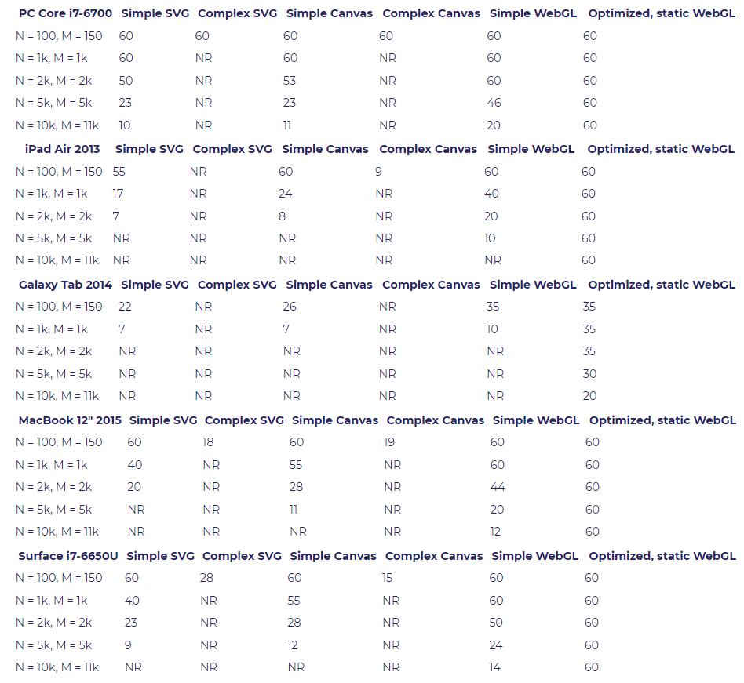

# JavaScript 可视化库D3介绍

## 渲染器的选择
在
- SVG
- Canvas
- HTML element
> 一般来说，Canvas 更适合绘制图形元素数量较多（这一般是由数据量大导致）的图表（如热力图、地理坐标系或平行坐标系上的大规模线图或散点图等），也利于实现某些视觉 特效。但是，在不少场景中，SVG 具有重要的优势：它的内存占用更低（这对移动端尤其重要）、并且用户使用浏览器内置的缩放功能时不会模糊。
> 选择哪种渲染器，我们可以根据软硬件环境、数据量、功能需求综合考虑。
>  在软硬件环境较好，数据量不大的场景下，两种渲染器都可以适用，并不需要太多纠结。
> 在环境较差，出现性能问题需要优化的场景下，可以通过试验来确定使用哪种渲染器。比如有这些经验：
> 在须要创建很多 ECharts 实例且浏览器易崩溃的情况下（可能是因为 Canvas 数量多导致内存占用超出手机承受能力），可以使用 SVG 渲染器来进行改善。大略得说，如果图表运行在低端安卓机，或者我们在使用一些特定图表如 水球图 等，SVG 渲染器可能效果更好。
> 数据量较大（经验判断 > 1k）、较多交互时，建议选择 Canvas 渲染器。
> 我们强烈欢迎开发者们反馈给我们使用的体验和场景，帮助我们更好的做优化。

d3.js当中主要使用SVG, 进行开发，相比直接操作恶心的HTML DOM,D3提供的一套声明式语法更加舒服。

