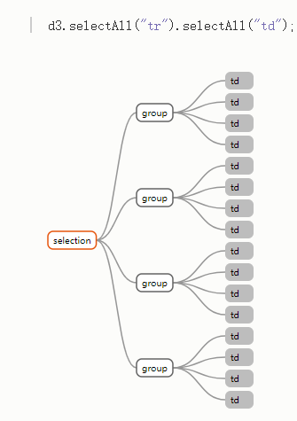
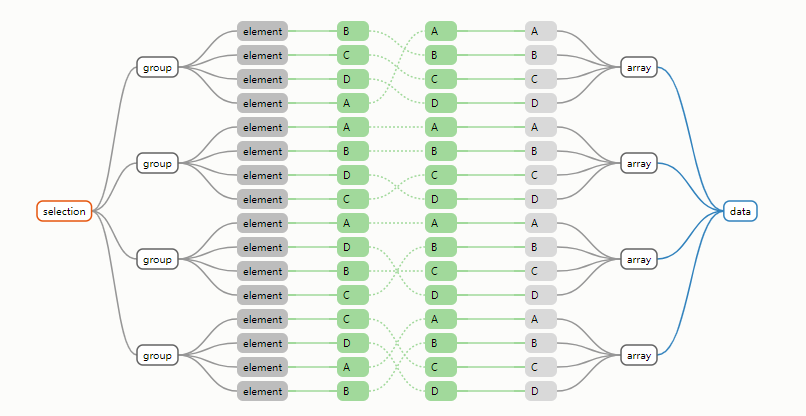
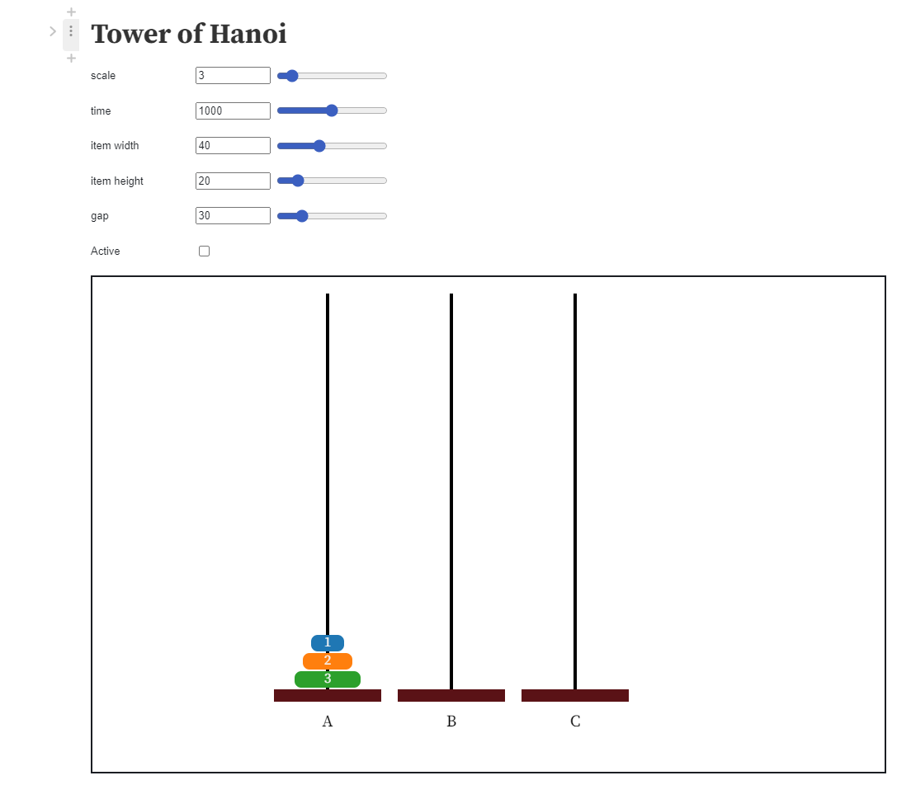
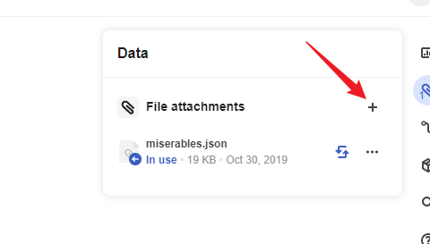
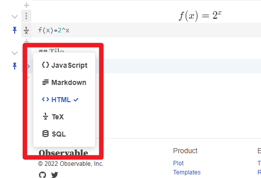

- [JavaScript 可视化库D3介绍](#javascript-可视化库d3介绍)
  - [渲染器的选择](#渲染器的选择)
  - [d3当中的核心概念](#d3当中的核心概念)
    - [最简单的一个例子](#最简单的一个例子)
    - [selection](#selection)
      - [概念](#概念)
      - [事件注册](#事件注册)
      - [数据绑定](#数据绑定)
  - [交互](#交互)
  - [模块](#模块)
    - [Forces](#forces)
  - [在线的可视化平台Observable](#在线的可视化平台observable)
# JavaScript 可视化库D3介绍

## 渲染器的选择
在
- SVG
- Canvas
- HTML element

> 一般来说，Canvas 更适合绘制图形元素数量较多（这一般是由数据量大导致）的图表（如热力图、地理坐标系或平行坐标系上的大规模线图或散点图等），也利于实现某些视觉 特效。但是，在不少场景中，SVG 具有重要的优势：它的内存占用更低（这对移动端尤其重要）、并且用户使用浏览器内置的缩放功能时不会模糊。
> 选择哪种渲染器，我们可以根据软硬件环境、数据量、功能需求综合考虑。
>  在软硬件环境较好，数据量不大的场景下，两种渲染器都可以适用，并不需要太多纠结。
> 在环境较差，出现性能问题需要优化的场景下，可以通过试验来确定使用哪种渲染器。比如有这些经验：
> 在须要创建很多 ECharts 实例且浏览器易崩溃的情况下（可能是因为 Canvas 数量多导致内存占用超出手机承受能力），可以使用 SVG 渲染器来进行改善。大略得说，如果图表运行在低端安卓机，或者我们在使用一些特定图表如 水球图 等，SVG 渲染器可能效果更好。
> 数据量较大（经验判断 > 1k）、较多交互时，建议选择 Canvas 渲染器。
> 我们强烈欢迎开发者们反馈给我们使用的体验和场景，帮助我们更好的做优化。

--- 《echarts 最佳实践》


d3.js当中主要使用 SVG 进行开发，相比直接操作恶心的HTML DOM,D3提供的一套声明式语法更加舒服。
目前主要维护人员之一是 mike-bostock 

```js
var paragraphs = document.getElementsByTagName("p");
for (var i = 0; i < paragraphs.length; i++) {
  var paragraph = paragraphs.item(i);
  paragraph.style.setProperty("color", "blue", null);
}
```

## d3当中的核心概念

### 最简单的一个例子

```js
d3.selectAll("p")
  .style("color", function(d, i) {
  return i % 2 ? "blue" : "red";
});
```
### selection
#### 概念

d3当中大部分的操作都是针对[selection](https://observablehq.com/@d3/d3-selection-2-0)进行的

* 事件侦听
* style属性设置
* 数据绑定
* ...

通过以下函数可以生成一个`selection`
```js
d3.create() //创造一个元素
d3.select() //选择匹配的第一个元素
d3.selectAll() //选择一组元素
```

Selection对象的结构如下
```js
{
    export function Selection(groups, parents) {
        this._groups = groups;
        this._parents = parents;
    }

    function selection() {
        return new Selection([[document.documentElement]], root);
    }

    function selection_selection() {
        return this;
    }

    Selection.prototype = selection.prototype = {
        constructor: Selection,
        select: selection_select,
        selectAll: selection_selectAll,
        selectChild: selection_selectChild,
        selectChildren: selection_selectChildren,
        filter: selection_filter,
        data: selection_data,
        enter: selection_enter,
        exit: selection_exit,
        ...
    };
}
```
实际生成 Selection 对象


生成的selection对象会有两个隐藏属性，来表示该selection的结构,selection具体是如何工作的，可以查看 Mike Bostock 的 *[How Selection work](https://bost.ocks.org/mike/selection/)*



d3通过创建或者选择DOM元素生成一个**Selection**

这些函数本质上也是调用的W3C DOM API中的[Selector API](https://www.w3.org/TR/selectors-api/)

```js
function empty() {
  return [];
}

export default function(selector) {
  return selector == null ? empty : function() {
    // 调用元素的selector
    return this.querySelectorAll(selector);
  };
}
```

#### 事件注册


早期版本的d3 是通过全局的d3.event获取当前事件信息，在后续版本已经移除,直接在事件监听器中传递当前的事件信息,[d3的版本](https://semver.org/lang/zh-CN/)可以通过全局暴露的`d3.version`获取

```js
 d3.selectAll("div")
      .on("mouseover", function(){
          d3.select(this)
            .style("background-color", "orange");
          // Get current event info
          console.log(d3.event);
          // Get x & y co-ordinates
          console.log(d3.mouse(this));
      })
      .on("mouseout", function(){
          d3.select(this)
            .style("background-color", "steelblue")
      });
```
 d3通过`selection.on()`方法注册事件监听器， 任何浏览器支持的[标准事件类型](https://developer.mozilla.org/en-US/docs/Web/Events#Standard_events)都支持

```js
d3.create("ul")
  .call(ul => ul.selectAll("li")
    .data(names)
    .join("li")
      .text(name => `My name is ${name}! `)
    .append("a")
      .attr("href", "#")
      .on("click", click)
      .text("Pick me."))
  .node()
```
#### 数据绑定

D3直接绑定数据到selection上,数据可以是任意数组类型，给定一个数组和selection就可以将每个数组元素追加到selection当中每个元素。

比如，一个number的数组
```js
[1,2,3,4,5];
```
或者一个二维数组
```js
const matrix = [
  [11975,  5871, 8916, 2868],
  [ 1951, 10048, 2060, 6171],
  [ 8010, 16145, 8090, 8045],
  [ 1013,   990,  940, 6907]
];
```
或者一个对象数组
```js
const letters = [
  {name: "A", frequency: .08167},
  {name: "B", frequency: .01492},
  {name: "C", frequency: .02780},
  {name: "D", frequency: .04253},
  {name: "E", frequency: .12702}
];
```

数据绑定会在对应的dom元素上挂载一个对应的`__data__`属性


data当中的数据和selection当中的元素对应关系如下



如果没有为数据绑定提供一个 **key function** 那么会默认的根据元素在DOM当中的顺序绑定数据

```js
d3.selectAll("div")
  .data(data, function(d) { return d ? d.name : this.id; })
    .text(d => d.number);
```

## 交互
## 模块

d3中提供的功能都是通过模块提供的，用户只需要按需引入对应的模块即可

* Arrays (Statistics, Search, Iterables, Sets, Transformations, Histograms, Interning)
* Axes
* Brushes
* Chords
* Colors
* Color Schemes
* Contours
* Voronoi Diagrams
* Dispatches
* Dragging
* Delimiter-Separated Values
* Easings
* Fetches
* Forces
* Number Formats
* Geographies (Paths, Projections, Spherical Math, Spherical Shapes, Streams, Transforms)
* Hierarchies
* Interpolators
* Paths
* Polygons
* Quadtrees
* Random Numbers
* Scales (Continuous, Sequential, Diverging, Quantize, Ordinal)
* Selections (Selecting, Modifying, Data, Events, Control, Local Variables, Namespaces)
* Shapes (Arcs, Pies, Lines, Areas, Curves, Links, Symbols, Stacks)
* Time Formats
* Time Intervals
* Timers
* Transitions
* Zooming

如果是绘制柱状图、折线图、这类图表，可以选择axes来提供定义坐标的样式,选择Scales来定义比例尺。如果还有颜色和交互上的需求可以选择 Zooming Drag 等模块 来缩放和拖拽

还有一些有意思的模块

* Forces,来提供力学模拟
* Geographies 提供地理以及几何的绘制

### Forces

D3的力学模拟是通过韦尔莱积分法(*Verlet Integration*)实现,通过对数据当中的节点添加力学函数来实现特定的力学模拟,每次触发`tick`事件时，会更新数据的各个属性
```js
 const simulation = d3.forceSimulation(nodes)
      .force("link", forceLink)
      .force("charge", forceNode)
      .force("center",  d3.forceCenter())
      .on("tick", ticked);
  ```
## 在线的可视化平台Observable

D3提供了一个在线的可视化平台[ Observable ](https://observablehq.com/explore)
为一些简单的例子提供了在线可运行的编辑器，并且封装了一些交互式组件提供了极大的便利



在Observable中的notebooks中编写的代码是分块执行的，各个代码块组成的程序结构是一个有向无环图(DAG)
更改其中的代码块之后会触发相关联的代码块重新执行


每个代码块要求必须返回一个值，如果返回的时HTML元素，那么会在notebooks当中进行渲染,
一个典型的代码块是

```js
{
  // 返回对应HTML元素
  return svg.node()
}
```


另外比较比较好用的功能是，Observable提供文件存储功能，可能利用它提供的`FileAttachment(file_name)`来访问对应的文件，以便对程序当中的数据进行填充



更方便的是可以提供类似 Jupter Notebooks 的功能，在编辑中可以书写markdown文档，而且提供部分*TeX*的数学公式语法支持，如果需要自定义样式的，也可以在代码块当中书写HTML


