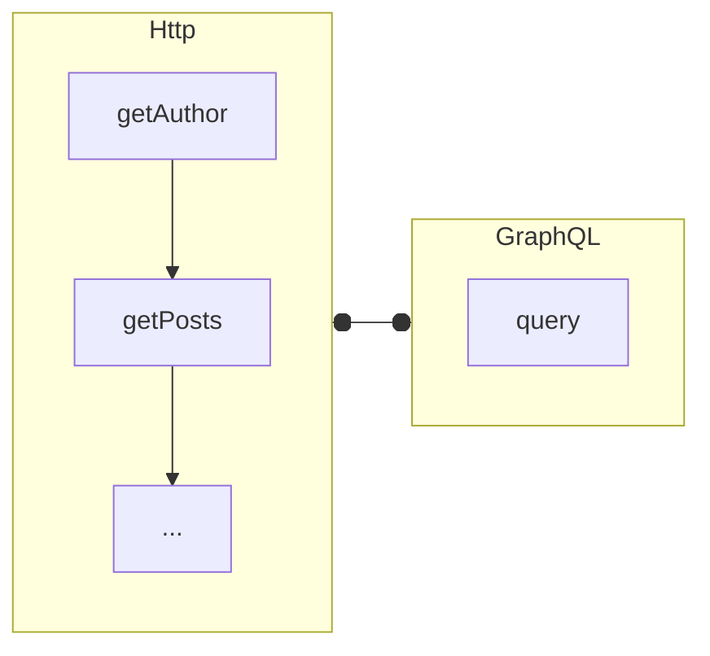
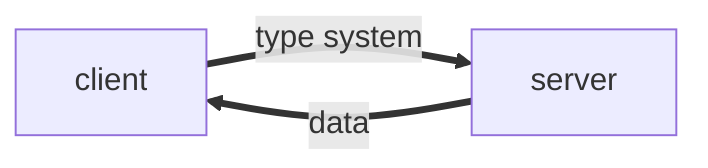
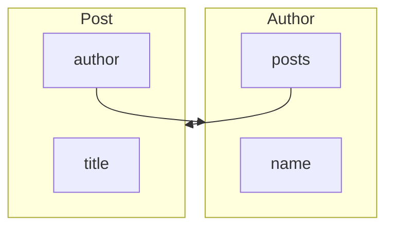

---
# try also 'default' to start fmple
theme: seriph
# random image from a curated Unsplash collection by Anthony
# like them? see https://unsplash.com/collections/94734566/slidev
# background: https://source.unsplash.com/collection/94734566/1920x1080
background: /img/GraphQl/background.jpg
# apply any windi css classes to the current slide
class: 'text-center'
# https://sli.dev/custom/highlighters.html
highlighter: shiki
# show line numbers in code blocks
lineNumbers: true
# some information about the slides, markdown enabled
info: |
  ## Slidev Starter Template
  Presentation slides for developers.

  Learn more at [Sli.dev](https://sli.dev)
# persist drawings in exports and build
drawings:
  persist: false

monaco: false
---

<div class="text-base-3xl inline-flex justify-center items-center">
  <logos-graphql class="text-8xl" /> GraphQL
</div>

---

###  New API style

2012年，<logos-facebook></logos-facebook> **Facebook** 在他们的原生移动应用中使用了 GraphQL , 在此之前，通用的 API 风格是 RESTful,而 GraphQL 是一个新的API标准, 它更加高效，更加强大的和更加灵活, 这样的想法并非只有 Facebook 独有，Netflix 开源过类似的方案 [falcor](https://github.com/Netflix/falcor)

---

### 解决了什么问题?


设想这样一个场景，当前页面需要新增卡片组件，显示员工的人名和职位，此时既有的接口包含了“所有的员工信息”

* 使用旧的的接口，存在数据传输冗余
* 设计新的接口， 需要和后端反复沟通，且维护的api数量越来越多

```json {all|5-6|all}
{
  "employee": [
    {
      "id": "1",
      "firstName": "Tom",
      "nation": "USA",
      "Language": "English",
      "job": "Director"
      ...
    },
    ...
  ]
}
```

> 我们当前使用的这种 API 风格被称为 RESTful , 是由*Roy Fielding*在 [Representational State Transfer (REST)](https://www.ics.uci.edu/~fielding/pubs/dissertation/rest_arch_style.htm) 中提出,


---

### 优势

不止这一种场景，当我们需要数据存在多个API当中时，我们也需要多次网络请求,
那么 GraphQL 相对于 REST api 到底解决了什么问题呢 ?




---

<div class="text-blue-500">

  使用 GraphQL 的 API 设计，我们只需要通过一个接口就能精准获取所需的信息

</div>

```graphql
query {
  author{
    name
  }
  posts {
    title
  }
}
```

---
layout: two-cols
---

GraphQL 是一个用于 API 的查询语言，是一个使用基于类型系统来执行查询的服务端运行时（类型系统由你的数据定义）

<!--  -->



::right::


<div class="ml-10">

  而这些所有的查询都是基于同一个api进行, 一个典型的 GraphQL 查询语句如下

```graphql
query {
  continents(code: "AS") {
    name
  }
}

```

[playground](https://countries.trevorblades.com/)

</div>


---


三种查询操作

1. `query` - 只读查询操作
2. `mutation` - 修改操作
3. `subscription` - 订阅一个事件，长期接受响应,其结果随着时间改变而改变

---

### `query`

带参数查询

```graphql
{
  person(id: 2) {
    name
  }
}
```


<div class="ml-2">

结果

```json
{
  "person": {
    "name": "Mark Zuckerberg"
  }
}
```

</div>

---

### `variables`

当存在多个相同的查询参数时或者想要动态的查询，可以使用 GraphQL 提供的变量,从而避免在客户端生成字符串

```graphql
query getContinent($code: String = "EU") {
  continents(code: $code) {
    code
    name
  }
}
```

在提交查询的时候可以把变量的定义带上，也可以提供一个默认值

```json
{
  query: ...,
  variables: {
    "code": "AS"
  }
}
```

---

### `mutation`

使用 GraphQL 修改数据

```graphql
mutation {
  setContinentName(name: "ASSSSSSSSSia") {
    continent {
      name
    }
  }
}
```

---

### 工作原理

每个类型的每个字段都由一个 resolver 函数支持，该函数由 GraphQL 服务器开发人员提供。当一个字段被执行时，相应的 resolver 被调用以产生一个值。

如果字段产生标量值，例如字符串或数字，则执行完成。如果一个字段产生一个对象，则该查询将继续执行该对象对应字段的解析器，直到生成标量值。GraphQL 查询始终以标量值结束

---

除了最常见的查询，如果想要进一步的性能提升,使用 GraphQL 还需要对缓存、权限管理等做进一步考虑和设置,以及需要避免一些恶意查询

<div class="flex flex-row">

<div class="flex-1">


</div>

<div class="flex-1">

  ```graphql
  {
    author{
      posts{
        author{
          posts{
            ...
          }
        }
      }
    }
  }
  ```
</div>

</div>


---

### 是否应该使用使用 GraphQL

GraphQL 正如其名字一样，如果数据都是图状数据且规模较大，那么会极大的提升前端生产力

---

### 推进 GraphQL 的使用

GraphsQL 不关心具体使用什么数据库和数据来源,可以在现有的系统之上进行改造

1. GraphQL 每一个字段对应一个 resolver， 每个 resolver 每一次查询都要去跑一次数据库,怎么优化？
```js
  person: ({id}) => database.getPerson(id)
```


2. 这个事情到底由谁来做？GraphQL 的利好主要是在于前端的开发效率，但落地却需要服务端的全力配合。如果是小公司或者整个公司都是全栈，那可能可以做，但在很多前后端分工比较明确的团队里，要推动 GraphQL 还是会遇到各种协作上的阻力

ref: https://www.zhihu.com/question/38596306/answer/79714979