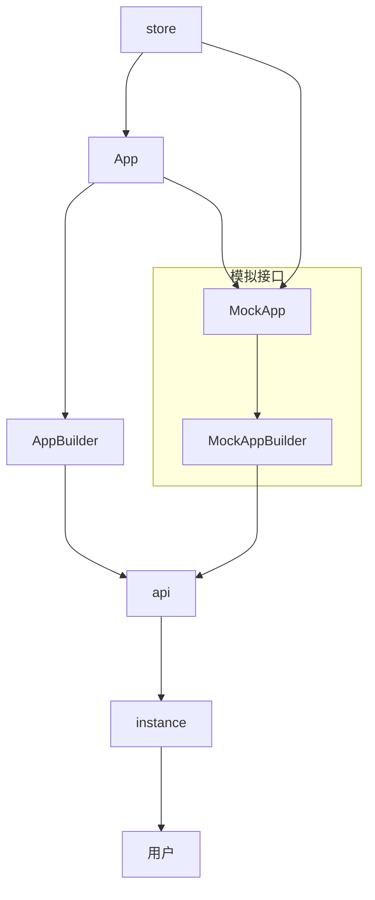

### App Mock

为了使`h5plus`项目在浏览器上开发页面，需要mock部分接口,以下是mock的整个设计，**对于实际的功能逻辑开发仍然需要在真机上进行**

#### 架构

只模拟App里面的所有接口，针对页面操作产生的副作用(除了`localstorage`存储之外)不予处理

对于请求本地地图文件，开启`debug`模式时，由用户自己判断当前所处的模式以决定使用何种方式请求数据

mock方式选择
<!-- 1. ~~代理App中的接口，拦截接口的参数，自定义返回值~~ -->
克隆一份App的文件, 根据开发模式选择对应的实例化对应的APP类`(√)`




问题

如果选择在business中注入数据,vite的插件**import-analysis**无法工作
因此注入数据还是选择在pages项目最开始`main.ts`中


#### 设置/标识当前的开发状态

利用`vite`提供的环境变量,在开发模式下设置`VITE_DEBUG`变量,修改`pages/src/.env.development`
值得注意的是, 该变量会在生产模式进行构建是会被**静态替换**

在`.env.development`中设置`VITE_DEBUG`即可开启或者关闭 mock

```env
VITE_DEBUG=true
```


#### mock工具

采用 `mocjs` 配合 `@types/mockjs`

1. [mockjs](https://github.com/nuysoft/Mock)

其他`mock`工具

2. [ts-mocktio](https://github.com/NagRock/ts-mockito) 待调研
3. [ts-auto-mock](https://typescript-tdd.github.io/ts-auto-mock/create-mock) 依赖多

#### 对不同类型的数据进行mock

1. 本地文件请求 替换为网络请求-[文件管理平台](http://192.168.0.6:3001/)上传对应的数据

2. 普通数据，利用mockjs模拟数据

待补充

#### 启动优化

1. 开启esbuild热加载, 增加 `--watch`参数
2. 开启tsc热加载 增加`--watch`参数
3. 优化build命令

### 登录页面

* 总体高度给一个 `min-height 600px`
* 输入表单相对顶部 `186px`
* 替换当前顶部背景插画

> 因为表单向上移动会遮住插画，因此设计稿插画内容变小

### 新建downloads文件夹

目录路径为`Android/data/plus.H50DD6511/downloads`

1. 提供接口`initDownloads`用以创建downloads文件夹
2. 在App第一次使用页面调用改接口创建downloads文件夹,涉及到的h5plus部分`file writer`


### 系统返回键

监听系统返回键，每一次按下都往`Event Bus`发送事件
每个页面单独处理返回键

### 版本规范

接口`/home/Com/appFunctionLevel` 返回值新增`version`字段

```ts
if (response.data.level >= 1) {
	//....
}
```

服务端提供一个独立的API版本与恒迹寻本身版本无关,在APP判断是否支持该服务器，之前对API版本判断只依靠`level`字段，而`level`字段只是简单的从1开始递增，没法做兼容判断，现在改为规范的版本号，`level`字段保留以兼容第一版APP,新增`version`字段

```json
{
	version: "....",
	level: 2
}
```

